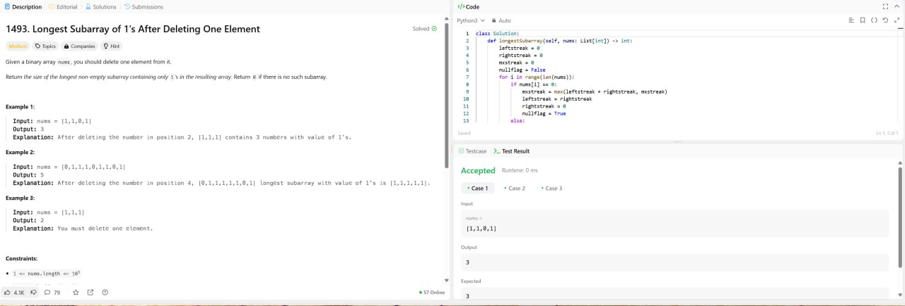
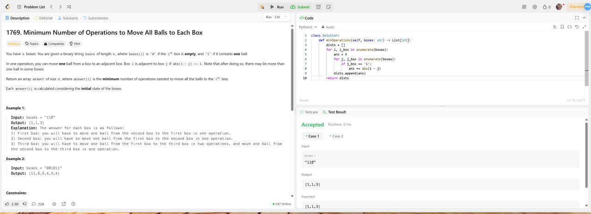
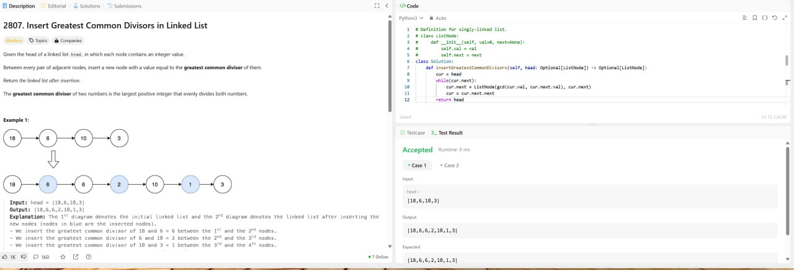
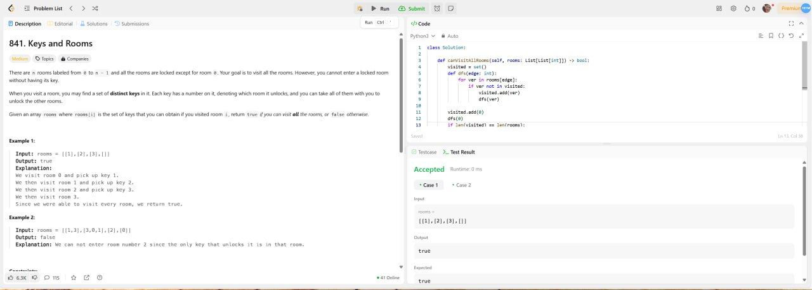

# Лабораторная работа №1

## Задача 1
###1493. Longest Subarray of 1's After Deleting One Element

Given a binary array nums, you should delete one element from it.

Return the size of the longest non-empty subarray containing only 1's in the resulting array. Return 0 if there is no such subarray.

Код задачи:
```python
def longestSubarray(self, nums: List[int]) -> int:
    leftstreak = 0
    rightstreak = 0
    mxstreak = 0
    nullflag = False
    for i in range(len(nums)):
        if nums[i] == 0:
            mxstreak = max(leftstreak + rightstreak, mxstreak)
            leftstreak = rightstreak
            rightstreak = 0
            nullflag = True
        else:
            rightstreak += 1
    mxstreak = max(leftstreak + rightstreak, mxstreak)
    if not nullflag:
        mxstreak -= 1
    return mxstreak
```



## Задача 2
###1769. Minimum Number of Operations to Move All Balls to Each Box

You have n boxes. You are given a binary string boxes of length n, where boxes[i] is '0' if the ith box is empty, and '1' if it contains one ball.

In one operation, you can move one ball from a box to an adjacent box. Box i is adjacent to box j if abs(i - j) == 1. Note that after doing so, there may be more than one ball in some boxes.

Return an array answer of size n, where answer[i] is the minimum number of operations needed to move all the balls to the ith box.

Each answer[i] is calculated considering the initial state of the boxes.

Код задачи:
```python
def minOperations(self, boxes: str) -> List[int]:
    dists = []
    for i, i_box in enumerate(boxes):
        ans = 0
        for j, j_box in enumerate(boxes):
            if j_box == '1':
                ans += abs(i - j)
        dists.append(ans)
    return dists
```


## Задача 3
###2807. Insert Greatest Common Divisors in Linked List

Given the head of a linked list head, in which each node contains an integer value.

Between every pair of adjacent nodes, insert a new node with a value equal to the greatest common divisor of them.

Return the linked list after insertion.

The greatest common divisor of two numbers is the largest positive integer that evenly divides both numbers.

Код задачи:
```python
def insertGreatestCommonDivisors(self, head: Optional[ListNode]) -> Optional[ListNode]:
    cur = head
    while(cur.next):
        cur.next = ListNode(gcd(cur.val, cur.next.val), cur.next)
        cur = cur.next.next
    return head
```


## Задача 4
###841. Keys and Rooms

There are n rooms labeled from 0 to n - 1 and all the rooms are locked except for room 0. Your goal is to visit all the rooms. However, you cannot enter a locked room without having its key.

When you visit a room, you may find a set of distinct keys in it. Each key has a number on it, denoting which room it unlocks, and you can take all of them with you to unlock the other rooms.

Given an array rooms where rooms[i] is the set of keys that you can obtain if you visited room i, return true if you can visit all the rooms, or false otherwise.

Код задачи:
```python
def canVisitAllRooms(self, rooms: List[List[int]]) -> bool:
    visited = set()
    def dfs(edge: int):
        for ver in rooms[edge]:
            if ver not in visited:
                visited.add(ver)
                dfs(ver)

    visited.add(0)
    dfs(0)
    if len(visited) == len(rooms):
        return True
    return False
```
