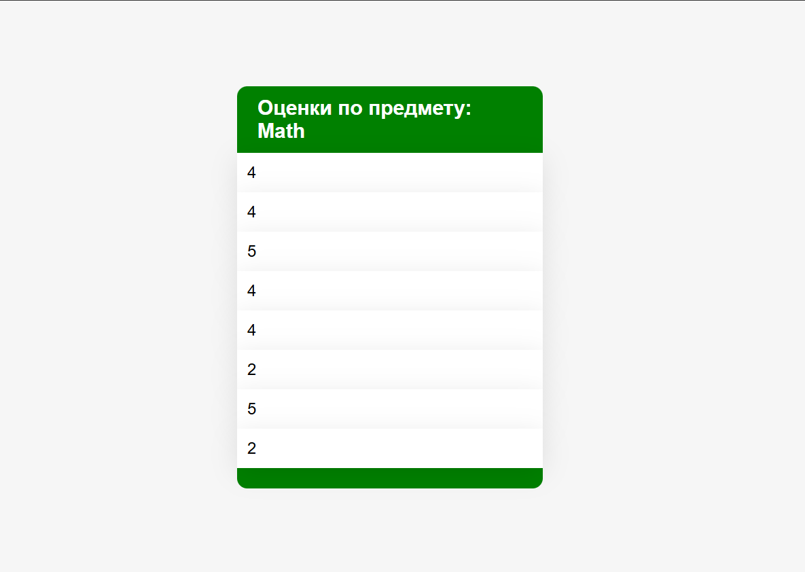

# Лабораторная работа №1

## Задание 1
Реализовать клиентскую и серверную часть приложения. Клиент отправляет серверу сообщение «Hello, server», и оно должно отобразиться на стороне сервера. В ответ сервер отправляет клиенту сообщение «Hello, client», которое должно отобразиться у клиента.

Код сервера:
```python
import socket

socket = socket.socket(socket.AF_INET, socket.SOCK_DGRAM)
socket.bind(('', 8080))

max_user = 1
response = b"Hello, client"
while True:
    client_data, addr = socket.recvfrom(1024)
    if not client_data:
        break
    print(client_data)
    socket.sendto(response, addr)
socket.close()
```
Код клиента:
```python
import socket

socket = socket.socket(socket.AF_INET, socket.SOCK_DGRAM)
while True:
    message = bytes(input(), 'utf-8')
    socket.sendto(message, ('localhost', 8080))
    response = socket.recv(1024)
    if not response:
        break
    print(response)
socket.close()
```

## Задание 2
Реализовать клиентскую и серверную часть приложения. Клиент запрашивает выполнение математической операции, параметры которой вводятся с клавиатуры. Сервер обрабатывает данные и возвращает результат клиенту.

Вариант операции: Поиск площади параллелограмма

Код сервера:
```python
import socket
import math

server_socket = socket.socket()
server_socket.bind(('', 8080))

max_user = 5
server_socket.listen(max_user)
while True:
    client_socket, addr = server_socket.accept()
    client_data = list(map(lambda x: int(x), client_socket.recv(1024).decode().split()))
    if not client_data or len(client_data) != 3:
        print("Invalid parameters for triangle area task")
        client_socket.close()
        break
    S = client_data[0] * client_data[1] * math.sin(client_data[2])
    client_socket.send(bytes(str(S), 'utf-8'))    
    print(client_data)
socket.close()
    
```
Код клиента:
```python
import socket

client_socket = socket.socket()
client_socket.connect(('localhost', 8080))
print("Please write the lengths of 2 sides and an angle of the parallelogramm:")
client_socket.send(bytes(input(), 'utf-8'))
res = client_socket.recv(1024)
print(f"Area = {res.decode()}")
client_socket.close()
```
## Задание 3
Реализовать серверную часть приложения. Клиент подключается к серверу, и в ответ получает HTTP-сообщение, содержащее HTML-страницу, которая сервер подгружает из файла index.html.
Код сервера:
```python
import socket


socket = socket.socket(socket.AF_INET, socket.SOCK_STREAM)
socket.bind(('', 8080))

max_conn_count = 5

socket.listen(max_conn_count)

while True:
    conn_socket, addr = socket.accept()
    request = conn_socket.recv(1024).decode().split()
    if request[0] != "GET":
        conn_socket.close()
        print("Bad Gateway")
        conn_socket.send(b'Response 400')
        conn_socket.close()
        break
    print(request)
    with open('index.html', 'r') as index:
        response = 'Response 200'
        print("OK")
        conn_socket.send(response.encode('utf-8'))
        conn_socket.close()
```
Код клиента:
```python
import http.client

host = 'localhost'
client_conn = http.client.HTTPConnection(host, 8080)
client_conn.request('GET', 'index.html')
response = client_conn.getresponse()
print(response.read().decode())
```
Код HTML-разметки
```html
<!DOCTYPE html>
<html lang="en">
<head>
    <meta charset="UTF-8">
    <title>WEB Lab1-3</title>
</head>
<body>
    <h1> Hello, it's html page, delivered from python socket server. </h1>
</body>
</html>
```
## Задание 4
Реализовать двухпользовательский или многопользовательский чат. Для максимального количества баллов реализуйте многопользовательский чат.

Требования:

* Обязательно использовать библиотеку socket.
* Для многопользовательского чата необходимо использовать библиотеку threading.

Код сервера:
```python
import socket
import threading
from copy import copy


max_conn_count = 10
locker = threading.Lock()
threads = []
connections = []

def threaded_handle(conn, address):
    while True:
        data = conn.recv(1024)
        if not data:
            conn.close()
            print(f"{address} connection interrupted")
            break
        msg = address[0] + ":" + str(address[1]) + " send a message: " + data.decode()
        print(msg)
        with locker:
            conn_copy = copy(connections)
        for c in conn_copy:
            c.sendall(msg.encode('utf-8'))


def main():
    a_socket = socket.socket(socket.AF_INET, socket.SOCK_STREAM)
    a_socket.bind(('', 8080))
    a_socket.listen(max_conn_count)

    while True:
        conn_socket, addr = a_socket.accept()
        conn_thread = threading.Thread(target=threaded_handle, args=(conn_socket, addr,))
        threads.append(conn_thread)
        connections.append(conn_socket)
        conn_thread.start()

if __name__ == "__main__":
    main()
```
Код клиента:
```python
import socket
import threading


getting_msg, host, port = True, 'localhost', 8080
client_locker = threading.Lock()

def show_chat(sock):
    while True:
        with client_locker:
            serv_data = sock.recv(1024)
        if not serv_data:
            with client_locker:
                sock.close()
            print("Connection closed")
            break
        print(serv_data.decode())


def main_client():
    client_socket = socket.socket()
    client_socket.connect((host, port))
    chat_thread = threading.Thread(target=show_chat, args=(client_socket,))
    chat_thread.start()

    while getting_msg:
        new_msg = input().encode('utf-8')
        client_socket.send(new_msg)

    chat_thread.join()


if __name__ == "__main__":
    main_client()
```
## Задание 5
Написать простой веб-сервер для обработки GET и POST HTTP-запросов с помощью библиотеки socket в Python.

Сервер должен:

* Принять и записать информацию о дисциплине и оценке по дисциплине.
* Отдать информацию обо всех оценках по дисциплинам в виде HTML-страницы.

Web-страница с оценками выглядит так:


Код сервера:
```python
import socket
import json
from bs4 import BeautifulSoup as bs
from urllib.parse import urlparse, parse_qs
from datetime import datetime

max_headers = 100


class HTTPRequest:
    def __init__(self, method, url, version, headers, r_body):
        self.method = method
        self.url = url
        self.version = version
        self.headers = headers
        self.body = r_body

    @property
    def parsed_url(self):
        return urlparse(self.url)

    @property
    def query(self):
        return parse_qs(self.parsed_url.query)


class HTTPResponse:
    def __init__(self, code, status, version, headers=None, body=None):
        self.code = code
        self.status = status
        self.version = version
        self.headers = headers
        self.body = body

    def compile(self):
        resp = f"{self.version} {self.code} {self.status}\n"
        if self.headers:
            for header, value in self.headers.items():
                resp += f"{header}: {value}\n"
        if self.body:
            resp += f"\n{self.body}"
        return resp


def compile_html(req, filename, json_file):
    soup = bs(open(filename, 'r+'), "html.parser")
    caption = soup.find('h2', {'id': 'subj_name'})
    mark_list = soup.find('ul', {'id': 'marks'})
    try:
        subj = req.query['subject'][0]
        caption.string = f"Оценки по предмету: {subj}"
        with open(json_file, 'r') as grades_file:
            subjects = json.load(grades_file)
            marks = subjects[subj]
        for mark in marks:
            mark_li = soup.new_tag('li')
            mark_li.string = mark
            mark_list.append(mark_li)
        return soup.prettify('utf-8').decode()
    except KeyError:
        raise Exception("Wrong request parameters")


class HTTPServer:
    def __init__(self, ip, port):
        self.ip = ip
        self.port = port
        self.name = "MyHTTPServer"
        self.http_v = "HTTP/1.1"

    def serve_forever(self):
        serv_sock = socket.socket()
        serv_sock.bind((self.ip, self.port))
        serv_sock.listen()
        try:
            while True:
                conn_socket, addr = serv_sock.accept()
                self.serve_client(conn_socket)
        finally:
            serv_sock.close()

    def serve_client(self, connection):
        req = self.parse_request(connection)
        if req:
            resp = self.handle_request(req).compile()
            resp_encoded = resp.encode()
            connection.sendall(resp_encoded)
        connection.close()

    def parse_request(self, connection):
        with connection.makefile('rb') as req_file:
            raw_first_line = req_file.readline()
            first_line = str(raw_first_line, 'utf-8')
            method, url, version = first_line.split()
            headers = self.parse_headers(req_file)
            return HTTPRequest(method, url, version, headers, req_file)

    def parse_headers(self, rfile):
        headers = dict()
        while len(headers) <= max_headers:
            r_line = rfile.readline().decode('utf-8')
            if r_line == '\n' or r_line == '' or r_line == '\r\n':
                return headers
            header, value = tuple(r_line.split())
            headers[header] = value
        raise Exception('too many headers')

    def handle_request(self, req):
        if req.parsed_url.path == "/grades":
            if req.method == "GET":
                html = compile_html(req, "html/index.html",
                                    "json/grades.json")
                resp_headers = {
                    "Server": self.name,
                    "Date": str(datetime.now()),
                    "Content-Length": len(html),
                    "Content-Type": "text/html; charset=utf-8"
                }
                return HTTPResponse(200, "OK", self.http_v, resp_headers, html)
            elif req.method == "POST":
                with open("json/grades.json", "r+") as grades_file:
                    subjects = json.load(grades_file)
                    try:
                        subjects[req.query["subject"][0]].append(req.query["mark"][0])
                    except KeyError:
                        raise Exception("Wrong request parameters")
                    grades_file.seek(0)
                    json.dump(subjects, grades_file)
                    grades_file.truncate()
                return HTTPResponse(204, "Created", self.http_v)
        else:
            return HTTPResponse(400, "Bad Request", self.http_v)


if __name__ == '__main__':
    host = '127.0.0.1'
    _port = 8080
    serv = HTTPServer(host, _port)
    try:
        serv.serve_forever()
    except KeyboardInterrupt:
        pass
```
Код клиента:
```python
import os
import http.client
import webbrowser


class HTTPClient:
    def __init__(self):
        self.conn = None

    def connect_to(self, ip, port):
        self.conn = http.client.HTTPConnection(ip, port)

    def post_mark(self, subj, grade):
        if not self.conn:
            raise Exception('No connection provided')
        self.conn.request('POST', f"/grades?subject={subj}&mark={grade}")
        serv_response = self.conn.getresponse()
        print(serv_response.status, serv_response.reason)

    def get_marks(self, subj):
        if not self.conn:
            raise Exception('No connection provided')
        self.conn.request('GET', f"/grades?subject={subj}")
        serv_response = self.conn.getresponse()
        path = "html/client.html"
        body = serv_response.read()
        with open(path, "wb") as cli_html:
            cli_html.write(body)
        webbrowser.open('file://' + os.path.realpath(path), new=2)


if __name__ == "__main__":
    _ip, _port = '127.0.0.1', 8080
    client = HTTPClient()
    while True:
        client.connect_to(_ip, _port)
        subject = input("Выберите предмет: ")
        choice = int(input("1 - Выставить(POST) оценку\n2 - Получить(GET) оценки\n"))
        if choice == 1:
            mark = int(input("Введите оценку от 2(неуд) до 5(отл): "))
            if mark < 2 or mark > 5:
                raise Exception('Оценка должна быть от 2(неуд) до 5(отл)')
            client.post_mark(subject, mark)
            continue
        client.get_marks(subject)
```
JSON c оценками 
```json
{
  "Math": ["4", "4", "5", "4", "4", "2", "5", "2"],
  "Geography": ["3", "4"],
  "Informatics": ["2", "5"],
  "Chemistry": ["2", "4"],
  "History": ["5", "4", "4", "2"],
  "English": ["4", "4", "2", "4", "2"],
  "PE": ["2", "5"],
  "Physics": ["5", "4"]
}

```