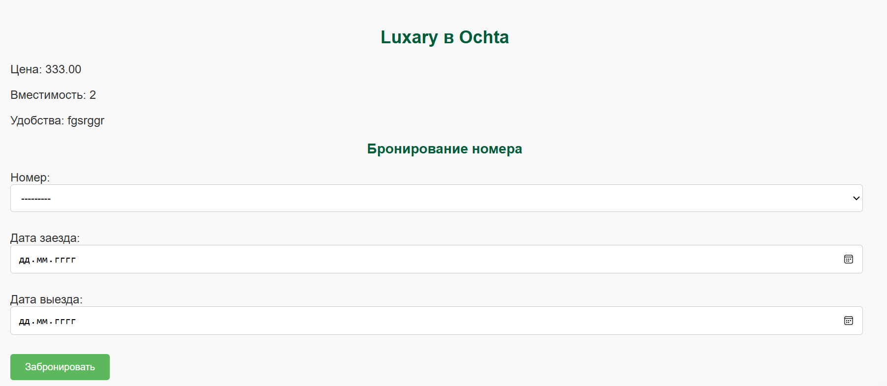
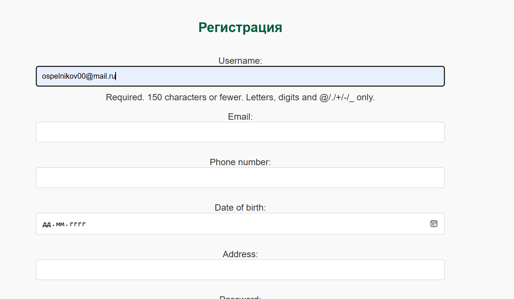
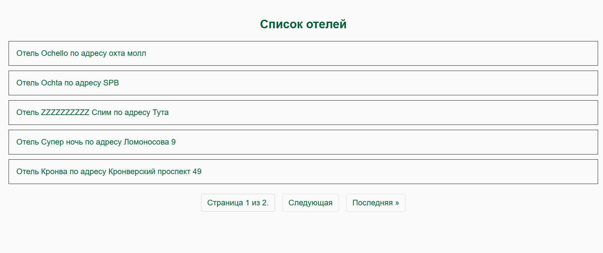
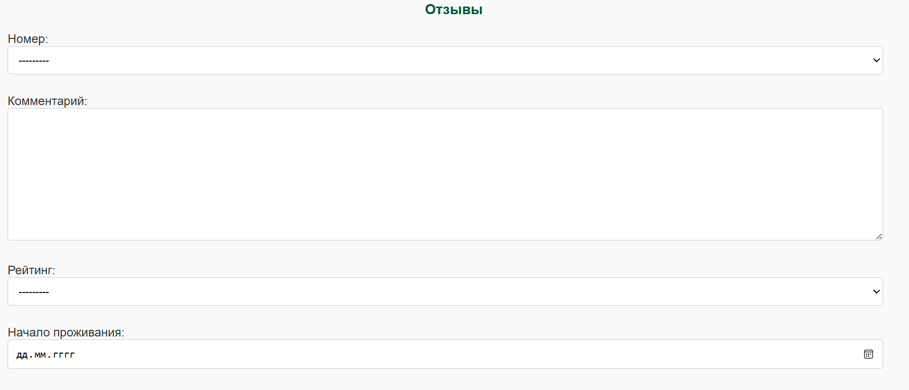

# Лабораторная работа №2
## Список отелей

&emsp;Необходимо учитывать название отеля, владельца отеля, адрес, описание, типы
номеров, стоимость, вместимость, удобства.

&emsp;Необходимо реализовать следующий функционал:

* Регистрация новых пользователей.
* Просмотр и резервирование номеров. Пользователь должен иметь возможность редактирования и удаления своих резервирований.
* Написание отзывов к номерам. При добавлении комментариев, должны сохраняться период проживания, текст комментария, рейтинг (1-10), информация о комментаторе.
* Администратор должен иметь возможность заселить пользователя в отель и выселить из отеля средствами Django-admin.
* В клиентской части должна формироваться таблица, отображающая
постояльцев отеля за последний месяц.
## Модели
### 1) Регистрация
&emsp;Модель служит для оформления гостя или работника в систему. Галочка на поле is_staff_member дает определенные права просмотра, в зависимости от должности
<br>&emsp;Добавление пользователя в систему проводится через оператора сайта, для регистрации достаточно указать данные
```python
class CustomUser(AbstractUser):
    phone_number = models.CharField(max_length=15, blank=True, null=True, verbose_name='Номер телефона')
    date_of_birth = models.DateField(blank=True, null=True, verbose_name='Дата рождения')
    is_staff_member = models.BooleanField(default=False, verbose_name='Сотрудник отеля')
    address = models.CharField(max_length=255, blank=True, null=True, verbose_name='Адрес')
    class Meta:
        verbose_name = 'Пользователь'
        verbose_name_plural = 'Пользователи'

    def __str__(self):
        return self.username
```

### 2) Бронированиe
&emsp;Модель служит для оформления брони на конкретный свободный номер
```python
class Booking(models.Model):
    user = models.ForeignKey(settings.AUTH_USER_MODEL, on_delete=models.CASCADE, related_name='bookings',
                             verbose_name='Пользователь')
    room = models.ForeignKey(Room, on_delete=models.CASCADE, verbose_name='Номер')
    check_in_date = models.DateField(verbose_name='Дата заезда')
    check_out_date = models.DateField(verbose_name='Дата выезда')
    is_active = models.BooleanField(default=True, verbose_name='Активная бронь')

    class Meta:
        verbose_name = 'Бронь'
        verbose_name_plural = 'Бронирования'

    def __str__(self):
        return f"Бронь {self.user.username} на {self.room}"
```
### 3) Отели
&emsp;Модель отвечает за внесение конкретного отеля в систему. Владелец или его доверенное лицо должны внести свою гостиницу в систему через администрацию сайта
```python
class Hotel(models.Model):
    name = models.CharField(max_length=200, verbose_name='Название отеля')
    owner = models.ForeignKey(settings.AUTH_USER_MODEL, on_delete=models.CASCADE, related_name='owned_hotels',
                              verbose_name='Владелец')
    address = models.CharField(max_length=200, verbose_name='Адрес')
    description = models.TextField(blank=True, verbose_name='Описание')

    class Meta:
        verbose_name = 'Отель'
        verbose_name_plural = 'Отели'

    def __str__(self):
        return self.name
```

### 4) Номер
&emsp;Эта модель служит для описания номера отеля, учитываются также пожелания и просьбы клиентов, если они прописаны
```python
class Room(models.Model):
    hotel = models.ForeignKey(Hotel, on_delete=models.CASCADE, related_name='rooms', verbose_name='Отель')
    room_type = models.ForeignKey(RoomType, on_delete=models.CASCADE, verbose_name='Тип номера')
    price = models.DecimalField(max_digits=10, decimal_places=2, verbose_name='Цена')
    capacity = models.IntegerField(verbose_name='Вместимость')
    amenities = models.TextField(blank=True, verbose_name='Удобства')

    class Meta:
        verbose_name = 'Номер'
        verbose_name_plural = 'Номера'

    def __str__(self):
        return f"{self.room_type.name} ({self.hotel.name})"
```
### 5) Тип номера
&emsp;В отдельную таблицу вносятся данные о типовых номерах отеля, к примеру люкс-номер, классический и т.д. Если у гостиницы есть уникальный номер, они могут его внести, обратившись к администрации
```python
class RoomType(models.Model):
    name = models.CharField(max_length=100, verbose_name='Тип номера')
    description = models.TextField(blank=True, verbose_name='Описание')

    class Meta:
        verbose_name = 'Тип номера'
        verbose_name_plural = 'Типы номеров'

    def __str__(self):
        return self.name
```

### 6) Бронированиe
&emsp;В этой таблице хранятся отзывы на отель, оценки номера, уборки и сервиса в целом
```python
class Review(models.Model):
    room = models.ForeignKey(Room, on_delete=models.CASCADE, related_name='reviews', verbose_name='Номер')
    user = models.ForeignKey(settings.AUTH_USER_MODEL, on_delete=models.CASCADE, verbose_name='Пользователь')
    comment = models.TextField(verbose_name='Комментарий')
    rating = models.IntegerField(choices=[(i, i) for i in range(1, 11)], verbose_name='Рейтинг')
    stay_start = models.DateField(verbose_name='Начало проживания')
    stay_end = models.DateField(verbose_name='Конец проживания')
    created_at = models.DateTimeField(auto_now_add=True, verbose_name='Дата отзыва')

    class Meta:
        verbose_name = 'Отзыв'
        verbose_name_plural = 'Отзывы'

    def __str__(self):
        return f"Отзыв от {self.user.name} на {self.room}"
```
## Сайт
На этой странице вы можете забронировать номер в отеле


Форма для регистрации выглядит так:


Все отели можно найти на этой странице


А тут можно оставить отзыв о номере и о гостинице
