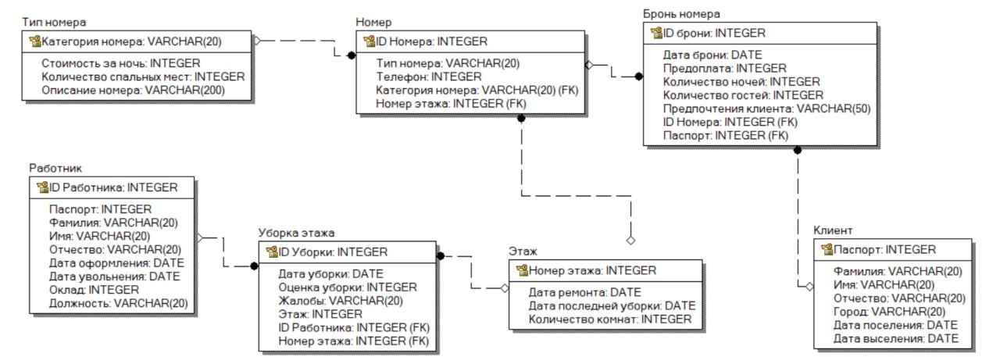

# Лабораторная работа №3

### Отель   
&emsp;Создать программную систему, предназначенную для администратора гостиницы.<br>
&emsp;Такая система должна обеспечивать хранение сведений об имеющихся в гостинице
номерах, о проживающих в гостинице клиентах и о служащих, убирающихся в номерах.
Количество номеров в гостинице известно, и имеются номера трех типов: одноместный,
двухместный и трехместный, отличающиеся стоимостью проживания в сутки. В каждом
номере есть телефон.<br>
&emsp;О каждом проживающем должна храниться следующая информация: номер
паспорта, фамилия, имя, отчество, город, из которого он прибыл, дата поселения в
гостинице, выделенный гостиничный номер.<br>
&emsp;О служащих гостиницы должна быть известна информация следующего содержания:
фамилия, имя, отчество, где (этаж) и когда (день недели) он убирает. Служащий
гостиницы убирает все номера на одном этаже в определенные дни недели, при этом в
разные дни он может убирать разные этажи.

&emsp;Работа с системой предполагает получение следующей информации:

* о клиентах, проживавших в заданном номере, в заданный период времени;
* о количестве клиентов, прибывших из заданного города,
* о том, кто из служащих убирал номер указанного клиента в заданный день недели,
* сколько в гостинице свободных номеров;
* список клиентов с указанием места жительства, которые проживали в те же дни, что и заданный клиент, в определенный период времени.

&emsp;Администратор должен иметь возможность выполнить следующие операции:

* принять на работу или уволить служащего гостиницы;
* изменить расписание работы служащего;
* поселить или выселить клиента.

&emsp;Необходимо предусмотреть также возможность автоматической выдачи отчета о
работе гостиницы за указанный квартал текущего года. Такой отчет должен содержать
следующие сведения:

* число клиентов за указанный период в каждом номере;
* количество номеров не каждом этаже;
* общая сумма дохода за каждый номер;
* суммарный доход по всей гостинице.
## Схема базы данных


## Модели
Модель профиля аккаунта
```python
class UserProfile(models.Model):
    user = models.OneToOneField(User,on_delete=models.CASCADE, related_name="profile")
    is_staff_member = models.BooleanField(default=False, verbose_name='Сотрудник отеля')
    passport_number = models.CharField(max_length=20, unique=True, verbose_name='Номер паспорта')
    last_name = models.CharField(max_length=100, verbose_name='Фамилия')
    first_name = models.CharField(max_length=100, verbose_name='Имя')
    middle_name = models.CharField(max_length=100, blank=True, null=True, verbose_name='Отчество')
    city = models.CharField(max_length=100, verbose_name='Город')
    bookings = models.ManyToManyField("booking.Booking", blank=True, null=True, related_name="user_profile", verbose_name='Брони')
```
Модель для регистрации броней
```python
class Booking(models.Model):
    book_date = models.DateField(verbose_name='Дата брони')
    prepayment = models.IntegerField(verbose_name='Предоплата')
    night_count = models.IntegerField(default=1, verbose_name='Количество ночей')
    guest_count = models.IntegerField(default=1, verbose_name='Количество гостей')
    client_preference = models.CharField(max_length=50, verbose_name='Предпочтения клиента')
    room_id = models.ForeignKey(Room, on_delete=models.CASCADE, verbose_name='Комната')
    guest_id = models.ForeignKey(UserProfile, on_delete=models.CASCADE, blank=True, null=True, verbose_name='Гость')
    statuses = [
        ("reg", "Зарегистрирована"),
        ("conf", "Подтверждена"),
        ("done","Завершена"),
        ("can", "Отменена")
    ]
    status = models.CharField(max_length = 20, choices=statuses, verbose_name='Статус')
```
Модели для типа комнаты и этажа соответственно
```python
class RoomType(models.Model):
    room_category = models.CharField(max_length=50, primary_key=True, verbose_name='Категория номера')
    night_cost = models.IntegerField(default=0, verbose_name='Стоимость за ночь')
    guest_count = models.IntegerField(default=2, verbose_name='Количество спальных мест')
    description = models.CharField(max_length=100, verbose_name='Описание')

class Floor(models.Model):
    fix_date = models.DateField(auto_now=True, verbose_name='Дата ремонта')
    clean_date = models.DateField(auto_now=True, verbose_name='Дата уборки')
    rooms_count = models.IntegerField(default=0, verbose_name='Количество номеров')
    cleaner = models.ManyToManyField("staff.Employee", related_name="cleaner", verbose_name='Уборщик')
```

Модель для номера отеля
```python
class Room(models.Model):
    room_category = models.ForeignKey(RoomType, on_delete=models.CASCADE, verbose_name='Категория номера')
    floor = models.ForeignKey(Floor, on_delete=models.CASCADE, verbose_name='Этаж')
    phone = models.IntegerField(default=0, verbose_name='Телефон')
    is_occupied = models.BooleanField(default=False, verbose_name='Занятость номера')
    is_active = models.BooleanField(default=True, verbose_name='Готовность номера')
    guest_count = models.IntegerField(default=2, verbose_name='Количество гостей')
    description = models.CharField(max_length=100, verbose_name='Описание')
```
Модель для регистрации уборок этажа
```python
class RoomClean(models.Model):
    complaints = models.CharField(max_length=50, verbose_name='Жалобы')
    clean_mark = models.IntegerField(default=5, verbose_name='Оценка')
    clean_date = models.DateField(auto_now_add=True, verbose_name='Дата уборки')
    floor = models.ForeignKey(Floor, on_delete=models.CASCADE, verbose_name='Этаж')
    worker_id = models.ForeignKey(Employee, blank=True, null=True, on_delete=models.CASCADE, verbose_name='Уборщик')
```
А также модель для сотрудников
```python
class Employee(models.Model):
    passport = models.CharField(max_length=50, verbose_name='Паспорт')
    full_name = models.CharField(max_length=50, verbose_name='ФИО')
    employee_date = models.DateField(auto_now_add=True, verbose_name='Дата трудоустройства')
    fire_date = models.DateField(null=True, blank=True, verbose_name='Дата увольнения')
    salary = models.IntegerField(verbose_name='Оклад')
    rank = models.CharField(max_length=50, verbose_name='Должность')
```
## Отчеты
1) О клиентах, проживавших в заданном номере, в заданный период времени

* URL: /api/books/get_books/
* Method: GET
* Auth required: YES
```python
@api_view(["GET"])
@csrf_exempt
def get_books(request):
    books = Booking.objects.all().order_by('book_date')
    serializer = BookingSerializer(books, many=True)
    return JsonResponse({'books': serializer.data}, safe=False, status=status.HTTP_200_OK)
```

2) О количестве клиентов, прибывших из заданного города

* URL: /api/accounts/get_guests/
* Method: GET
* Auth required: YES
```python
@api_view(["GET"])
@csrf_exempt
def get_guests(request):
    city = request.query_params.get('city')
    guests = UserProfile.objects.filter(city=city)
    serializer = UserProfileSerializer(guests, many=True)
    return JsonResponse({'count': len(serializer.data)}, safe=False, status=status.HTTP_200_OK)
```

3) О том, кто из служащих убирал номер указанного клиента в заданный день недели

* URL: /api/books/get_books/
* Method: GET
* Auth required: YES
```python
@api_view(["GET"])
@csrf_exempt
def get_books(request):
    books = Booking.objects.all().order_by('book_date')
    serializer = BookingSerializer(books, many=True)
    return JsonResponse({'books': serializer.data}, safe=False, status=status.HTTP_200_OK)

```

4) Сколько в гостинице свободных номеров

* URL: /api/hotel/get_empty_rooms/
* Method: GET
* Auth required: YES
```python
@api_view(["GET"])
@csrf_exempt
def get_empty_rooms(request):
    rooms = Room.objects.filter(is_occupied=True)
    serializer = RoomSerializer(rooms, many=True)
    return JsonResponse({'rooms': len(serializer.data)}, safe=False, status=status.HTTP_200_OK)
```
5) список клиентов с указанием места жительства, которые проживали в те же дни, что и заданный клиент, в определенный период времени

* URL: /api/accounts/get_guests_on_neighbour/
* Method: GET
* Auth required: YES
```python
@api_view(["GET"])
@csrf_exempt
def get_guests_on_neighbour(request):
    name = request.query_params.get('name')
    guests = UserProfile.objects.get(last_name=name)
    dates = Booking.objects.get(guest_id=guests).book_date
    other_books = Booking.objects.filter(book_date=dates)
    data = {'guests': []}
    for book in other_books:
        data['guests'].append([book.guest_id.last_name, book.guest_id.city])
    return JsonResponse(data, safe=False, status=status.HTTP_200_OK)
```