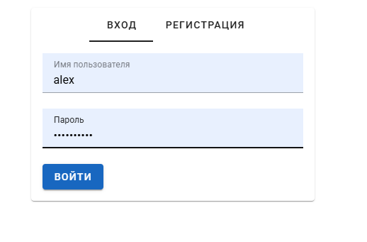
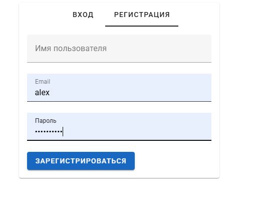
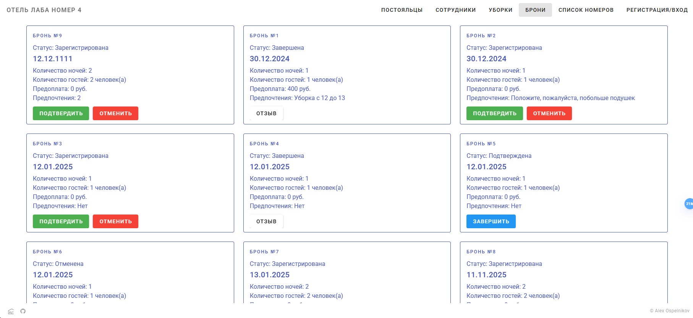
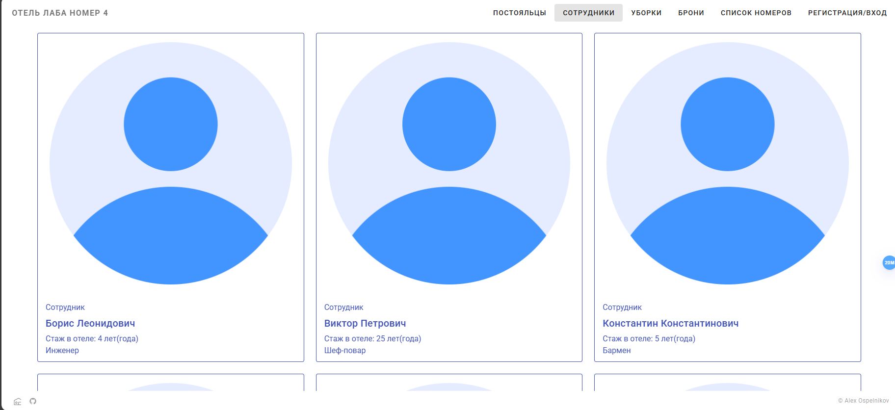
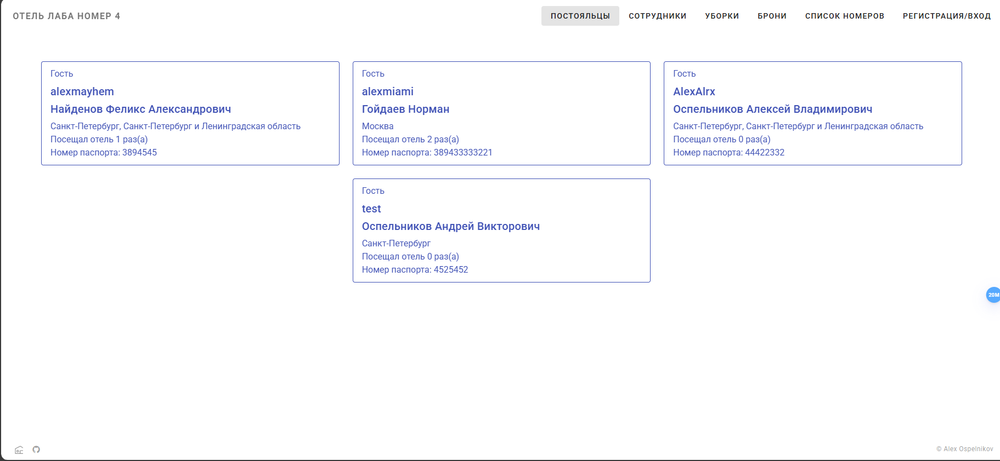
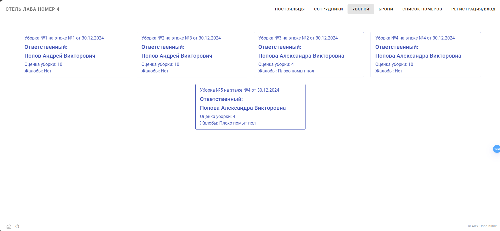
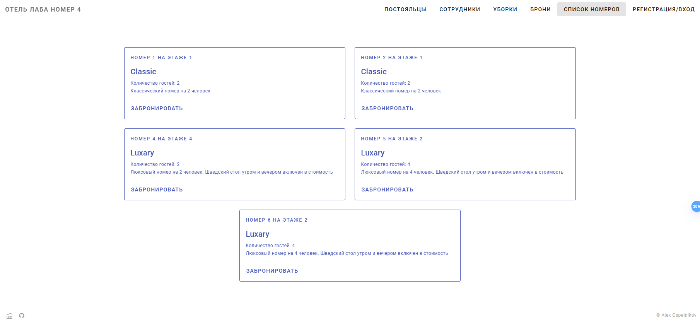

# Лабораторная работа №4

## Авторизация
Авторизация и регистрация на сайте выглядит следующим образом

**URL:** http://localhost:3000/auth

## Брони
Все брони с возможностью изменения их статуса, страница для администраторов и портье

**URL:** http://localhost:3000/books

## Сотрудники
Так выглядят карточки сотрудников, фотографии будут добавлены

**URL:** http://localhost:3000/staff

## Постояльцы
Список постоянных (и не очень) гостей

**URL:** http://localhost:3000/guests

## Уборки
На этой странице можно просмотреть все оцененные уборки этажей

**URL:** http://localhost:3000/cleans

## Список номеров
Пользователь может выбрать удобный ему номер и здесь же забронировать его

**URL:** http://localhost:3000/bookings

